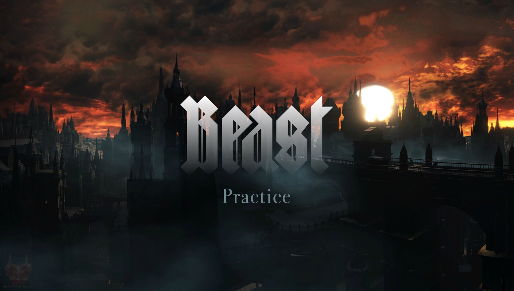

# Beast Practice

Это не [доментация к инстурменту](/README.md), а набор практических советов и согласующийся с ним codestyle.

- [Разработка компонента](articles/01-component-development.md) ✓
- [Наследование компонент](articles/02-component-inheritance.md) ✓
- [Имплементация компонент](articles/03-component-implementation.md) ✓
- [Взаимодействие компонент](articles/04-component-interaction.md) ✓
- [Организация стилей](articles/05-css.md)
- [Работа с живыми данными](articles/06-live-data.md) ✓
- [Разработка библиотеки](articles/08-lib.md)
- [Разработка проекта](articles/09-project.md)
